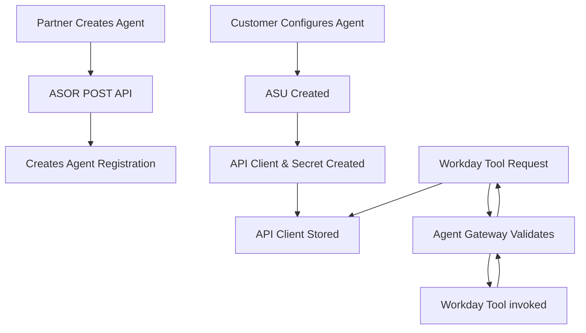

# Workday Agent Definition API

## 📋 Navigation
- [🏠 All Versions](#)
- [📖 Previous: v1 Spec](versions/v1.md) : [📖 Previous: v1 JSON](versions/v1.json)
- [📖 Previous: v1.1 Spec](versions/v1.1.md) : [📖 Previous: v1.1 JSON](versions/v1.1.json)
- [📖 Current: v1.2 Spec](versions/v1.2.md) : [📖 Current: v1.2 JSON](versions/v1.2.json)

---

## 📊 Version Differences

### v1.2 vs v1.1 Changes

The following table outlines the key differences between API versions v1.2 and v1.1:

| Feature | v1.1 | v1.2 | Impact |
|---------|------|------|--------|
| **Tool Configuration** | Basic `tool_name` and `description` | Enhanced with `agent_resource.id` and nested `tools` array | **ENHANCEMENT** - Better tool management and resource linking |
| **Resource Linking** | Simple tool references | Structured `agent_resource` objects with IDs | **ENHANCEMENT** - Improved traceability and resource management |
| **Nested Tools** | Flat tool structure | Hierarchical `tools` array within workdayResources | **NEW** - Support for tool hierarchies and dependencies |
| **Provider ID** | Basic Text | Reference ID to identify a Provider | **ENHANCEMENT** - Rather than use basic text, we have Internal Representations of Providers which match |
| **Execution Mode** | Basic Text | Enum Type way of identifying an Execution Mode | **ENHANCEMENT** - Rather than use basic text, you can be sure you have a correct Execution Mode |

#### Migration Guide: v1.1 → v1.2

**Required Changes:**

1. **Update Tool Resource References**
   ```json
   // v1.1 (Basic tool reference)
   {
     "operation": "Workday GET Workers API",
     "description": "This Workday tool is used to get Workers"
   }
   
   // v1.2 (Enhanced with agent_resource)
   {
     "tool_name": "Workday GET Workers API",
     "description": "This Workday tool is used to get Workers at the Org level",
   }
   ```

2. **Implement Nested Tools Structure**
   ```json
   // v1.1 (Old Tool Support)
   {
     "operation": "Workday GET Workers API",
     "description": "This Workday tool is used to get Workers",
     "tool": {
       "id": "3e15b2a1676d10000c9572ea9cc264b3"
     }
   }

   // v1.2 (New nested tools support)
   {
     "tool_name": "GET: Public Workday WQL using Active Employees Data Source",
     "description": "This tool will be used to get worker information based on defined queries.",
     "agent_resource": {
       "id": "3e15b2a1676d10000c9572ea9cc264b3"
     },
     "tools": [
       {
         "id": "845b47537cfc47b29da4f385628a5fe2"
       }
     ]
   }
   ```

3. **Provider Details**
   ```json
   // v1.1 (Basic Provider reference)
   {
     "provider": {
         "organization" : "Org Name",
         "url" : "https://myorg.com"
      }
   }
   
   // v1.2 (Enhanced with Reference IDs)
   {
     "provider": {
         "id" : "Provider=MyOrg"
      }
   }
   ```

4. **Execution Mode Details**
   ```json
   // v1.1 (Basic Execution Mode reference)
   {
     "executionMode": {
        "mode": "Delegate"
      }
   }
   
   // v1.2 (Enhanced with Reference IDs)
   {
     "executionMode": {
        "id": "Mode=Delegate"
      }
   }
   ```

   For a list of Providers and Certified Partners to use in the new Provider field, please contact Workday.

**Backward Compatibility:**
- v1.1 agents will not work due to required Provider and Execution Mode changes. Please make sure you update the payload to fit the new requirements.
- ASOR Hub will display warnings for agents using deprecated patterns

---

## Introduction

The Workday Agent Definition API intends to facilitate the creation of Agent Definitions that can operate seamlessly with Workday tools and resources. Using industry terminology to cross frameworks and languages, this API intends to make it easy for partners and their ecosystems to allow users to interact with Workday data.

The primary objective of this API is to:

* Create Agents with Skills that can safely and securely access Workday data.
* Discover broadly what capabilities customers and partners can do with other Agents and their Skills.
* Have fine grained knowledge of what individual users can access.

Comprehensive specification defining the core concepts of Agents, Skills, and Tools within the Agent System of Record Service. This document provides the foundational understanding for building and integrating with ASOR-managed agents.

## 🎯 Core Concepts Overview

It's important to define the core concepts of Agents, Skills, and Tools within the Agent System of Record Service. This document provides the foundational understanding for building and integrating with ASOR-managed agents.

### Hierarchical Relationship
```
🤖 Agent (Ambient or Delegate Entity)
├── 🎯 Skill (Discrete Capability)
│   ├── 🔧 Tool (External Resource)
│   ├── 🔧 Tool (Processing Service)
│   └── 🔧 Tool (Data Source)
├── 🎯 Skill (Another Capability)
│   ├── 🔧 Tool (API Endpoint)
│   └── 🔧 Tool (ML Model)
└── 🎯 Skill (Communication Capability)
    ├── 🔧 Tool (Messaging Service)
    └── 🔧 Tool (Notification API)
```

### Ambient Agents

An **Ambient** agent can be defined as an agent which can be invoked by events or notifications in the system, and acts independently from human interaction. **Ambient** agents are capable of being started on a schedule and running a skill with another event being pushed or notification being sent.

### Delegate Agents

A **Delegate** agent can be defined as an agent which is invoked by a human, either through direct connection and request, or through a conversation and an orchestrator picking an appropriate skill that the user has access to. A **Delegate** agent can hand off to other skills in other agents to complete it's work, and do not need to send push notifications out when complete.

### Agent Lifecycle in ASOR

| Phase | Description | ASOR API Operation |
|-------|-------------|-------------------|
| **Registration** | Agent is defined and registered in the system | `POST /agentDefinition` |
| **Discovery** | Agent capabilities are made discoverable | Agent Card at `GET /agentDefinition` |
| **Activation** / **Configuration** | Agent is configured with Workday security and becomes available for task execution | Status updates via ASOR Hub |
| **Operation** | Agent executes skills and collaborates | Skill invocation and tool usage with visibility in ASOR Hub |
| **Evolution** | Agent capabilities are updated/enhanced | `PUT /agentDefinition/{id}` (WIP) |
| **Deactivation** | Agent is turned off | Deactivated via ASOR Hub |

---

## 🎯 Skill Definition

### What is a Skill?

A **Skill** represents a discrete, well-defined capability or function that an agent can perform. Skills are the building blocks of agent functionality, representing specific domains of expertise or types of tasks.

#### Skill Characteristics

| Characteristic | Description | Example |
|----------------|-------------|---------|
| **🎯 Atomic** | Single, focused purpose | `analyze_financial_statement` vs `do_everything` |
| **📥 Parameterized** | Accepts defined inputs | Document URL, analysis type, compliance framework |
| **📤 Deterministic Output** | Produces predictable results | Structured analysis report with confidence scores |
| **🔍 Discoverable** | Can be found and invoked programmatically | Listed in Agent Card with parameters schema |
| **🧩 Composable** | Can combine with other skills | Document analysis → Anomaly detection → Report generation |
| **🧠 Context-Aware** | Leverages agent's knowledge | Uses previous analysis history for better results |

## 🚀 Implementation Examples

### Creating an Agent with Multiple Skills

v1.2 (2025.45)

```json
{
  "name": "Customer Service Intelligence Agent",
  "description": "Multi-skilled agent for customer service automation and intelligence",
  "url": "https://acme.com/agent/cust",
  "provider": {
    "id": "Provider=MyOrg"
  },
  "version": "1.0.0",
  "documentationUrl": "https://agent.company.com/agent1/doc",
  "capabilities": {
    "streaming": true
  },
  "defaultInputModes": [{"type": "text/plain"}],
  "defaultOutputModes": [
    {"type": "application/ms-excel"},
    {"type": "text/plain"}
  ],
  "skills": [
    {
      "id": "sentiment_analysis",
      "name": "Customer Sentiment Analysis",
      "description": "Analyzes customer communication sentiment and emotional state",
      "outputModes": [{"type": "application/json"}],
      "tags": [{"tag": "cognitive"}]
    },
    {
      "id": "ticket_routing",
      "name": "Intelligent Ticket Routing",
      "description": "Routes customer tickets to appropriate departments",
      "tags": [{"tag": "integration"}]
    }
  ],
  "workdayConfig": [
    {
      "skillId": "sentiment_analysis",
      "executionMode": {
        "id": "Mode=Ambient"
      },
      "workdayResources": [
        {
          "tool_name": "Workday GET Workers API",  
          "description":"This Workday tool is used to get Workers at the Org level",
          "agent_resource": {
            "id": "94a39e71541b468fa895955508287acd"
          }
        },
        {
          "description":"This tool will be used with the Workday feedback data to do deep analysis.",
          "tool_name": "GET: https://non-workday-api.com/feedback/model"
        },
        {
          "description":"This tool will be used to get worker information based on defined queries.",
          "tool_name": "GET: Public Workday WQL using Active Employees Data Source.",
          "agent_resource": {
            "id": "3e15b2a1676d10000c9572ea9cc264b3"
          },
          "tools":
          [
            {
              "id": "845b47537cfc47b29da4f385628a5fe2"
            }
          ]
        }
      ]
    },
    {
      "skillId": "ticket_routing",
      "executionMode": {
        "id": "Mode=Delegate"
      },
      "workdayResources": [
        {
          "tool_name": "Workday Case Types GET",
          "description":"This Workday tool reads all Case Types in the Help Application",
          "agent_resource": {
            "id": "94f4c8460640100019b5cf1caa7d0019"
          }
        },
        {
          "tool_name": "Workday Tenant Configuration for Case Management",
          "description":"This Workday tool is used to find how this tenant configures Case Management.",
          "agent_resource": {
            "id": "ddc7b3fdde02100015348b8f1b4a001f"
          }
        }
      ]
    }
  ]
}
```

---

## 🔄 Integration Architecture

### Agent-Skill-Tool Interaction Flow



In this example, the Agent is executing in a non-Workday ecosystem but importantly requires a Workday Financial API to complete it's analysis. It will forward the request to Workdays Agent Gateway, which validates the appropriate security groups defined when the Agent was configuered in the customers tenant.

---

## 🔍 Best Practices

### Agent Design Principles

**✅ Single Responsibility:** Each agent should have a clear, focused purpose rather than trying to do everything. Be clear and mindful about what might be labled as an orchestrator vs a skill based agent.

**✅ Skill Modularity:** Design skills to be readily usable by not just the domain context it was built it, but by many domains.

**✅ Tool Abstraction:** Abstract tool interfaces so skills aren't tightly coupled to specific implementations.

### Common Anti-Patterns

**❌ Monolithic Skills:** Avoid creating skills that try to handle too many different types of tasks.

**❌ Tool Coupling:** Don't hardcode specific tool implementations within skill logic.

**❌ Missing Error Handling:** Always implement proper error handling and fallback mechanisms for tool failures. Can Agents try something else?

---
